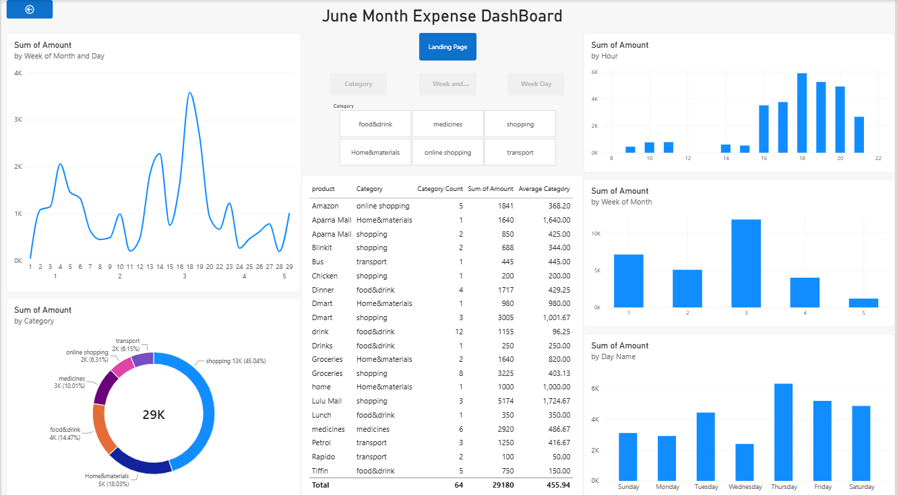

<h1>💰 Personal Expenses Data Analysis | Excel • Python • Power BI</h1>

An end-to-end Data Analytics project demonstrating data cleaning, exploratory data analysis, visualization, and business insights using Excel, Python (Pandas), and Power BI.

<ul>
  <li>Excel</li>
  <li>Python</li>
  <li>Pandas</li>
  <li>Power BI</li>
  <li>Data Cleaning</li>
  <li>EDA</li>
  <li>Data Cleaning</li>
</ul>

<h2>Project Overview</h2>

This project analyzes personal monthly expenses to identify spending patterns, category-wise expenditure, and opportunities for better financial planning.

The project follows a real-world Data Analyst workflow:

<ul>
  <li>Data Collection</li>
  <li>Data Cleaning</li>
  <li>Data Transformation</li>
  <li>Exploratory Data Analysis (EDA)</li>
  <li>Dashboard Creation</li>
  <li>Business Insights</li>
</ul>

The objective is to transform raw expense records into meaningful insights through data analysis and visualization.

<h2>Dashboard Preview</h2>

<h2>Business Problem</h2>

Raw expense records often make it difficult to understand:

<ul>
    <li>Where money is being spent</li>
    <li>Which categories consume the highest budget</li>
    <li>Monthly spending trends</li>
    <li>Opportunities to reduce unnecessary expenses</li>
</ul>

This project solves these challenges by converting raw transactional data into an interactive analytical dashboard.

<h2>Tech Stack</h2>
<table>
  <tr>
    <th>Tool</th>
    <th>Purpose</th>
  </tr>
  <tr>
    <td>Excel</td>
    <td>Data collection and initial dataset preparation</td>
  </tr>
  <tr>
    <td>Python</td>
    <td>Data cleaning and analysis</td>
  </tr>
  <tr>
    <td>Pandas</td>
    <td>Data manipulation</td>
  </tr>
  <tr>
    <td>OpenPyXL</td>
    <td>Excel file processing</td>
  </tr>
  <tr>
    <td>Power BI</td>
    <td>Interactive dashboard creation</td>
  </tr>
</table>

<h2>Project Workflow</h2>

<ol>
    <li>Imported raw expense data from Excel.</li>
    <li>Cleaned missing values using Pandas.</li>
    <li>Standardized transaction records.</li>
    <li>Prepared a structured dataset.</li>
    <li>Performed exploratory data analysis.</li>
    <li>Created visualizations to identify spending trends.</li>
    <li>Built an interactive Power BI dashboard.</li>
</ol>

<h2>Dataset Information</h2>

The dataset contains daily expense transactions with fields such as:

<table>
  <tr>
    <th>Column</th>
    <th>Description</th>
  </tr>
  <tr>
    <td>Date</td>
    <td>Transaction date</td>
  </tr>
  <tr>
    <td>Product</td>
    <td>Purchased item</td>
  </tr>
  <tr>
    <td>Category</td>
    <td>Expense category</td>
  </tr>
  <tr>
    <td>Amount</td>
    <td>Transaction amount</td>
  </tr>
  <tr>
    <td>Total</td>
    <td>Total spending value</td>
  </tr>
</table>

<h2>Data Cleaning Performed</h2>

The Python notebook includes several practical cleaning steps:

<ul>
    <li>Filled missing date values.</li>
    <li>Validated dataset completeness.</li>
    <li>Checked null values.</li>
    <li>Structured the dataset.</li>
    <li>Exported cleaned data for reporting.</li>
</ul>

Example:

df['date'].ffill(inplace=True)

<h2>Exploratory Data Analysis</h2>

The analysis focuses on answering questions such as:

<ul>
    <li>Which category has the highest spending?</li>
    <li>How are expenses distributed across categories?</li>
    <li>What are the monthly spending patterns?</li>
    <li>Which expenses could be optimized?</li>
</ul>

Python libraries used:

import pandas as pd

<h2>Power BI Dashboard Features</h2>

The dashboard provides:

<ul>
    <li>Category-wise expense analysis</li>
    <li>Spending distribution</li>
    <li>Interactive filtering</li>
    <li>Clean business-style visualization</li>
    <li>Quick financial overview</li>
</ul>

Typical visuals include:

<ul>
    <li>KPI Cards</li>
    <li>Bar Charts</li>
    <li>Pie Charts</li>
    <li>Trend Analysis</li>
</ul>

<h2>Key Insights</h2>

From the analysis:

<ul>
    <li>Food expenses contributed a significant portion of spending.</li>
    <li>Grocery purchases formed another major expense category.</li>
    <li>Medical-related expenses were comparatively lower.</li>
    <li>The dashboard helps identify areas where future spending can be reduced.</li>
</ul>

<h2>Skills Demonstrated</h2>

<ul>
    <li>Data Cleaning</li>
    <li>Exploratory Data Analysis</li>
    <li>Data Transformation</li>
    <li>Dashboard Development</li>
    <li>Business Insight Generation</li>
    <li>Excel Data Handling</li>
    <li>Python Programming</li>
    <li>Power BI Reporting</li>
</ul>

<h2>Why This Project Matters</h2>

This project demonstrates practical skills expected from an entry-level Data Analyst, including:

<ul>
    <li>Working with real datasets</li>
    <li>Cleaning imperfect data</li>
    <li>Generating actionable insights</li>
    <li>Building professional dashboards</li>
    <li>Communicating findings effectively</li>
</ul>

<h2>Future Improvements</h2>

<ul>
    <li>Add SQL integration for data storage.</li>
    <li>Automate monthly expense updates.</li>
    <li>Create DAX measures for advanced KPIs.</li>
    <li>Publish the dashboard to Power BI Service.</li>
    <li>Add forecasting for future expenses.</li>
</ul>

<h2>About Me</h2>

I'm Abdhul Raheman, an aspiring Data Analyst with hands-on experience in:

<ul>
    <li>Microsoft Excel</li>
    <li>MySQL</li>
    <li>Python</li>
    <li>Power BI</li>
    <li>Add forecasting for future expenses.</li>
</ul>

I'm actively building real-world analytics projects while transitioning into a Data Analyst role.

<h2>Connect With Me</h2>

LinkedIn: www.linkedin.com/in/abdhul-raheman-sheik-483b90250

GitHub: https://github.com/abdhulraheman

<h2>⭐ If you found this project useful</h2>

Please consider giving it a Star. It helps increase the visibility of my work and motivates me to build more real-world data analytics projects.
